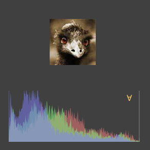

# Photo histogram in CoffeeKup --- _[Smooth CoffeeScript](http://autotelicum.github.com/Smooth-CoffeeScript/)_

> This literate program is _interactive_ in its HTML form. Edit a CoffeeScript segment to try it.

## Photo histogram

It is easy to prototype an idea with CoffeeScript and CoffeeKup. This program shows separation of color channels as a starting point for some photo analysis.

### HTML Rendering

In CoffeeKup you write a CoffeeScript function that is `render`ed to HTML. That function can contain the page elements, styling and CoffeeScript functions that are used on the web page. It can also refer to external files so you can modularize and separate the look and feel from the content. To load a script include a tag such as: `script src: 'underscore.js'`.

This `histogram` program can run embedded in a web page, where the program can be changed interactively or it can run standalone. Scripts are loaded into the `window` environment in a web browser, in the standalone environment `global` and `require` are used instead.

An existential test on `exports` can be used to determine which environment the program is running in --- another way is to look at whether the `window` environment is available.

~~~~ {.coffeescript}
kup = if exports? then require 'coffeekup' else window.CoffeeKup

webapp = ->
~~~~

### User Interface

Since the program will use a `canvas` and some Unicode characters, its `doctype` and `charset` are HTML5 and UTF-8. The CSS styling for the application is --- so far --- very simple so it is included in-line. That is convenient when experimenting, if you are reading this on the web page then you can change the styling and immediately see the effect on the [output](#output).

~~~~ {.coffeescript}
  doctype 5
  html ->
    head ->
      meta charset: 'utf-8'
      title 'Histogram'
      style 'body        {color: #FFFFFF;  background-color: #404040}
             #background {position: absolute; top:  40px; left: 20px}
             #image      {position: absolute; top:   0px; left: 80px}
             #picture    {position: absolute; top:   0px; left: 80px}
             #histogram  {position: absolute; top: 140px; left:  0px}'
~~~~

The `img` tag is used to load a photo normally from a file, however in the interactive environment it is instead loaded from a global predefined variable[^1]. The application does not need to display the original picture, instead it shows a `canvas` with the processed `picture`. That `canvas` is therefore set to the same size and placed via absolute positioning right on top of it.

[^1]: This is a side effect of how the interactive environment is constructed . It uses an `iframe` with a URI encoded `data` attribute to display the embedded HTML output. The image is encoded in base64 and predefined to simplify the process. It is not something you would need to do when using CoffeeKup outside of this environment.

~~~~ {.coffeescript}
    body ->
      div id: 'background', ->
        img    id: 'image', width: 90, height: 90, \
          src: window?.ostrich ? '../img/ostrich.jpg'
        canvas id: 'picture', width: 90, height: 90
        canvas id: 'histogram', width: 256, height: 100, \
          onClick: 'onChange()'
~~~~

### Functionality

The application responds to `click` events on the histogram by displaying either all color channels combined or one of the red, green, blue, or the transparency/alpha channel. First in the web application's CoffeeScript section is a definition of constants and a variable `view` that holds an index of what is currently displayed. 

~~~~ {.coffeescript}
    coffeescript ->
      hues =
        red:      'rgba(255, 128, 128, 0.5)'
        green:    'rgba(128, 255, 128, 0.5)'
        blue:     'rgba(128, 128, 255, 0.5)'
        alpha:    'rgba(128, 128, 128, 0.5)'
      legend    = ['∀', 'R', 'G', 'B', 'α']
      textColor = '#F7C762'
      textFont  = '12pt Times'
      textPos   = x:230, y:-80
      view      = 0
~~~~

The data in a photo is stored according to the definition given in [HTML Canvas 2D Context](http://www.w3.org/TR/2011/WD-2dcontext-20110405/#dom-imagedata-data) by W3C:

> The CanvasPixelArray object provides ordered, indexed access to the color components of each pixel of the image data. The data must be represented in left-to-right order, row by row top to bottom, starting with the top left, with each pixel's red, green, blue, and alpha components being given in that order for each pixel. Each component of each device pixel represented in this array must be in the range 0..255, representing the 8 bit value for that component. The components must be assigned consecutive indices starting with 0 for the top left pixel's red component.

This standardized image format makes it easy to count the values in each of the channels with the `for ... in` statement's index feature and the modulus `%` operator.

~~~~ {.coffeescript}
      analyze = (data) ->
        bins = red: [], green: [], blue: [], alpha: []
        for name, bin of bins
          bin[i] = 0 for i in [0..255]
        for val, i in data
          switch i % 4
            when 0 then bins.red[val]++
            when 1 then bins.green[val]++
            when 2 then bins.blue[val]++
            when 3 then bins.alpha[val]++
        bins
~~~~

The width of the `histogram` canvas was chosen to be the same as the number of values in each of the color channel `bins`: 256. That simplifies the drawing of the plots, they only have to be scaled to match the height of the canvas. Since the y-coordinate on a canvas defaults to start at the top, the `scale` function is used to turn the coordinate system upside down --- but only after the text `legend` has been printed in its predetermined location.

~~~~ {.coffeescript}
      drawGraphs = (ctx, graphs) ->
        drawPlot = (ctx, plot, color) ->
          ctx.fillStyle = color
          ctx.beginPath()
          ctx.moveTo 0, 0
          for y, x in plot
            ctx.lineTo x, y
          ctx.lineTo plot.length, 0
          ctx.closePath()
          ctx.fill()

        ctx.translate 0, ctx.canvas.height
        ctx.fillStyle = textColor
        ctx.font = textFont
        ctx.fillText  legend[view], textPos.x, textPos.y
        ctx.scale 1, -1                        # flip y-axis
        drawPlot ctx, graphs.red,   hues.red   if view in [0, 1]
        drawPlot ctx, graphs.green, hues.green if view in [0, 2]
        drawPlot ctx, graphs.blue,  hues.blue  if view in [0, 3]
        drawPlot ctx, graphs.alpha, hues.alpha if view in [0, 4]
~~~~

### Events

Shared variables, `canvas` contexts, and the display are initialized when the application has loaded. 

~~~~ {.coffeescript}
      window.onload = ->
        $ = (element) -> document.getElementById element
        @image = $ 'image'
        @canvas = $ 'picture'
        @histogram = $ 'histogram'

        @context = canvas.getContext '2d'
        @plot = histogram.getContext '2d'
        unless @context? or @plot?
          alert 'No canvas in this browser.'
          return
        window.onChange()
~~~~

A complete redraw is performed when a touch or click triggers an update. If it is an RGB channel that is being displayed then the other channels are set to zero so only the contribution from the current channel is shown in the photo. The `view` index is updated and clamped.

~~~~ {.coffeescript}
      window.onChange = ->
        @histogram.width = @histogram.width     # reset
        @plot.clearRect 0, 0, @histogram.width, @histogram.height
        @context.drawImage @image, 0, 0

        picture = @context.getImageData 0, 0,
          @image.width, @image.height
        graphs = analyze picture.data
        drawGraphs @plot, graphs, view

        if 0 < view < 4
          picture = @context.getImageData 0, 0,
            @image.width, @image.height
          for i in [0...picture.data.length] by 1
            unless i%4 in [3, view-1] # unless alpha or current
              picture.data[i] = 0
          @context.putImageData picture, 0, 0

        if view++ is 4 then view = 0
        return
~~~~

### Wrap-up

This last bit do not relate to the web application but to the CoffeeKup `render`ing. The generated HTML is displayed either live in the interactive environment or as text --- as nicely formatted as possible.

~~~~ {.coffeescript}
webpage = kup.render webapp, format:on
showDocument webpage
~~~~

-----------------------------------------------------------------------------

## Output

~~~~ {.output}

~~~~

\ 

\VerbatimInput[baselinestretch=1,fontsize=\footnotesize,numbers=left]{histogram.output}

## JavaScript

~~~~ {.js-source}

~~~~

\VerbatimInput[baselinestretch=1,fontsize=\footnotesize,numbers=left]{histogram.js}

-----------------------------------------------------------------------------

Formats [Standalone](http://autotelicum.github.com/Smooth-CoffeeScript/literate/histogram-output.html)	[CoffeeScript](http://autotelicum.github.com/Smooth-CoffeeScript/literate/histogram.coffee)	[Markdown](http://autotelicum.github.com/Smooth-CoffeeScript/literate/histogram.md) [PDF](http://autotelicum.github.com/Smooth-CoffeeScript/literate/histogram.pdf) [HTML](http://autotelicum.github.com/Smooth-CoffeeScript/literate/histogram.html)

License [Creative Commons Attribution Share Alike](http://creativecommons.org/licenses/by-sa/3.0/)
by autotelicum © 2554/2011

<!---------------------------------------------------------------------------
Commands used to extract code, execute it, and to format this document:

Edit ,x/^~~+[   ]*{\.coffeescript.*}$/+,/^~~+$/-p
Edit ,>ssam -n 'x/^~~+[   ]*{\.coffeescript.*}$/+,/^~~+$/-' |cat embed-standalone.coffee - |tee histogram.coffee | coffee -cs >histogram.js; coffee histogram.coffee |tee histogram-output.html >histogram.output; open histogram-output.html; plumb histogram-output.html
Edit ,>pandoc -f markdown -t html -S -5 --css pandoc-template.css --template pandoc-template.html -B embed-readability.html -B embed.html | ssam 's/(<code class="sourceCode coffeescript")/\1 contenteditable=\"true\"/g' | ssam 's//<canvas id=\"drawCanvas\" width=\"0\" height=\"0\"><\/canvas>/' >histogram.html; open histogram.html; plumb histogram.html
Edit ,>markdown2pdf --listings --xetex '--template=pandoc-template.tex' -o histogram.pdf; open histogram.pdf

To execute these commands; middle-button select them in the acme environment.
acme and ssam are part of the plan9 OS and can run on *nix variants via plan9port.
The formatting is done with pandoc, a universal markup converter, and TeX.
---------------------------------------------------------------------------->
