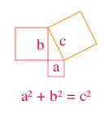

% Point distance: hypot --- _[Smooth CoffeeScript](http://autotelicum.github.com/Smooth-CoffeeScript/)_
% 
% ☕

> This literate program is _interactive_ in its HTML form. Edit a CoffeeScript segment to try it. You can see the generated JavaScript as you modify a CoffeeScript function by typing 'show name' after its definition.

## Point distance algorithm

_Warning!_ This snippet is about calculating the distance between two points --- not something you would normally worry about. It is a fundamental calculation that can be used in other algorithms such as 'nearest neighbor'.

A point is any object that implements `x` and `y` properties. Here defined as a class.

~~~~ {.coffeescript}
class Point
  constructor: (@x, @y) ->
  draw: (ctx) -> ctx.fillRect @x, @y, 1, 1
  toString: -> "(#{@x}, #{@y})"
~~~~

### Euclidean distance

The euclidean distance between two points is
$\sqrt{\left(x_{1}-x_{2}\right)^{2}+\left(y_{1}-y_{2}\right)^{2}}$.
Which can be written as
$\sqrt{a^{2}+b^{2}}$ where $a=x_{1}-x_{2}$ and $b=y_{1}-y_{2}$.

~~~~ {.coffeescript}
euclidean = (p1, p2) ->
  [a, b] = [p1?.x - p2?.x, p1?.y - p2?.y]
  Math.sqrt Math.pow(a, 2) + Math.pow(b, 2)
~~~~

This is a classical algorithm based on the Pythagorean theorem.

~~~~ {.CoffeeScript}
draw = (ctx) ->
  # A hard-coded approximate figure
  ctx.beginPath()
  ctx.fillStyle = 'crimson'
  ctx.font = '14pt Times'
  ctx.fillText 'a² + b² = c²', 27, 110

  ctx.fillText 'a', 66, 74
  ctx.beginPath()
  ctx.strokeStyle = 'hotpink'
  ctx.strokeRect 60, 60, 20, 20

  ctx.fillText 'b', 46, 47
  ctx.beginPath()
  ctx.strokeStyle = 'tomato'
  ctx.strokeRect 20, 20, 40, 40

  ctx.fillText 'c', 74, 42
  ctx.beginPath()
  ctx.strokeStyle = 'darkorange'
  ctx.moveTo 60, 20
  ctx.lineTo 80, 60
  ctx.lineTo 120, 40
  ctx.lineTo 100, 0
  ctx.lineTo 60, 20
  ctx.stroke()
~~~~

\ 

### Improved precision calculation

Mathematically the `euclidean` calculation is correct and in normal use it will work. However for very large and very small numbers its results are imprecise --- more imprecise than they have to be. This is a consequence of the difference between numbers in mathematics and computer floating point numbers. The precision of the results are limited due to the square of the differences, the square causes overflow or underflow to occur at the square root of the machine precision. Fortunately some clever person found that expressing the calculation in another way can improve upon this situation, see [Wikipedia hypot](http://en.wikipedia.org/wiki/Hypot).

$\sqrt{a^{2}+b^{2}}$ =
$\sqrt{a^{2}\cdot\left(1+\left(\frac{b}{a}\right)^{2}\right)}$ =
$\left|a\right|\sqrt{1+\left(\frac{b}{a}\right)^{2}}$ 

~~~~ {.coffeescript}
hypot = (a, b) ->
  if a is 0
    Math.abs b
  else
    Math.abs(a) * Math.sqrt 1 + Math.pow b/a, 2
hypotenuse = (p1, p2) ->
  [a, b] = [p1?.x - p2?.x, p1?.y - p2?.y]
  hypot a, b
~~~~

### Polar coordinates

As described in [Wikipedia hypot](http://en.wikipedia.org/wiki/Hypot), the `hypot` function can also be used to convert to polar coordinates.

~~~~ {.coffeescript}
polar = (p) ->
  [x, y] = [p.x, p.y]
  r = hypot x, y
  θ = Math.atan2 y, x
  [r, θ]
show 'Distance from (0, 0), angle in 2π radians'
show polar new Point 1, 1
~~~~

### Edge case tests

Testing with some exceptional values is a good way to check that the function behave as intended.

~~~~ {.coffeescript}
show "euclidean vs hypotenuse"
p1 = p2 = undefined
show "#{euclidean p1, p2} vs #{hypotenuse p1, p2}"

p1 = new Point 0, 0
p2 = new Point 0, 0
show "#{euclidean p1, p2} vs #{hypotenuse p1, p2}"

p1 = new Point 1e-200, 1e-200
p2 = new Point 2e-200, 2e-200
show "#{euclidean p1, p2} vs #{hypotenuse p1, p2}"

p1 = new Point 1e200, 1e200
p2 = new Point 2e200, 2e200
show "#{euclidean p1, p2} vs #{hypotenuse p1, p2}"
~~~~

## QuickCheck

More comprehensive testing can be performed with QuickCheck. It is a test method where the properties of a function are described and data is generated to see if the properties hold. It is suitable for testing algorithms (in game logic and graphics) and is introduced in [Smooth CoffeeScript Functions](http://autotelicum.github.com/Smooth-CoffeeScript/SmoothCoffeeScript.html#entry-testing-0). There is also an [interface reference](http://autotelicum.github.com/Smooth-CoffeeScript/SmoothCoffeeScript.html#toc-Subsection--23).

### How to

You can find some support code in the solution below. It can be used with `qc.js` to run QuickCheck with the standalone CoffeeScript compiler.

~~~~ {.CoffeeScript}
unless exports?
  _ = window._ # Workaround for interactive environment quirk.
else
  show = console.log
  _ = require 'underscore'
  qc = require 'qc'
  # Import functions into the global namespace with globalize,
  # so that they do not need to be qualified each time.
  globalize = (ns, target = global) ->
    target[name] = ns[name] for name of ns
  # qc is only used for testing so ignore namespace pollution.
  globalize qc

if exports?
  # Set to `no` to get monochrome output
  useColors = no

  # Node colored output for QuickCheck.
  class NodeListener extends ConsoleListener
    constructor: (@maxCollected = 10) ->
    log: (str) -> show str
    passed: (str) -> # print message in green
      console.log if useColors then "\033[32m#{str}\033[0m" else "#{str}"
    invalid: (str) -> # print message in yellow
      console.warn if useColors then "\033[33m#{str}\033[0m" else "#{str}"
    failure: (str) -> # print message in red
      console.error if useColors then "\033[31m#{str}\033[0m" else "#{str}"
    done: ->
      show 'Completed test.'
      resetProps() # Chain here if needed

  # Enhanced noteArg returning its argument so it can be used inline.
  Case::note = (a) -> @noteArg a; a
  # Same as Case::note but also logs the noted args.
  Case::noteVerbose = (a) -> @noteArg a; show @args; a
  
  # Helper to declare a named test property for
  # a function func taking types as arguments.
  # Property is passed the testcase, the arguments
  # and the result of calling func, it must return
  # a boolean indicating success or failure.
  testPure = (func, types, name, property) ->
    declare name, types, (c, a...) ->
      c.assert property c, a..., c.note func a...
  
  # Default qc configuration with 100 pass and 1000 invalid tests
  qcConfig = new Config 100, 1000
  
  # Test all known properties
  test = (msg, func) ->
    _.each [msg, func, runAllProps qcConfig, new NodeListener],
      (o) -> unless _.isUndefined o then show o
~~~~

### Test cases

This test says that the `hypot` function is expected to return the same result as the `euclidean`. The `euclidean` is assumed to be correct for the usually generated arbInt numbers.

~~~~ {.coffeescript}
declare 'same results for normal range numbers',
  [arbInt, arbInt, arbInt, arbInt],
  (c, x1, y1, x2, y2) ->
    p1 = new Point x1, y1
    p2 = new Point x2, y2
    d1 = euclidean p1, p2
    d2 = hypotenuse p1, p2
    diff = d1 - d2
    epsilon = 1e-10
    c.assert -epsilon < diff < epsilon
~~~~

The next tests say that the `hypot` function is expected to return different results for large numbers. There are different ways of doing so.

~~~~ {.coffeescript}
arbBig = arbRange 1e155, 1e165
declare 'different results for big range numbers',
  [arbBig, arbBig, arbBig, arbBig],
  (c, x1, y1, x2, y2) ->
    p1 = new Point x1, y1
    p2 = new Point x2, y2
    d1 = euclidean p1, p2
    d2 = hypotenuse p1, p2
    diff = Math.abs d1 - d2
    epsilon = 1e-10
    c.assert diff > epsilon
~~~~

~~~~ {.coffeescript}
declare 'different results for large numbers',
  [arbInt, arbInt, arbInt, arbInt, arbInt, arbInt],
  (c, x1, y1, e1, x2, y2, e2) ->
    p1 = new Point x1*Math.pow(10, e1), y1*Math.pow(10, e1)
    p2 = new Point x2*Math.pow(10, e2), y2*Math.pow(10, e2)
    d1 = euclidean p1, p2
    d2 = hypotenuse p1, p2
    diff = Math.abs d1 - d2
    c.guard diff > 1
    exp = 9
    c.assert e1 < -exp or e1 > exp or e2 < -exp or e2 > exp
~~~~

The results will vary on each run as the data is generated. The floating point precision is implementation dependent.

~~~~ {.coffeescript}
do test
~~~~

-----------------------------------------------------------------------------

\subsection{Output}
\VerbatimInput[baselinestretch=1,fontsize=\footnotesize,numbers=left]{hypot.output}

\subsection{JavaScript}
\VerbatimInput[baselinestretch=1,fontsize=\footnotesize,numbers=left]{hypot.js}

\rule[0.5ex]{1\columnwidth}{1pt}

Formats [CoffeeScript](http://autotelicum.github.com/Smooth-CoffeeScript/literate/hypot.coffee)	[Markdown](http://autotelicum.github.com/Smooth-CoffeeScript/literate/hypot.md) [PDF](http://autotelicum.github.com/Smooth-CoffeeScript/literate/hypot.pdf) [HTML](http://autotelicum.github.com/Smooth-CoffeeScript/literate/hypot.html)

License [Creative Commons Attribution Share Alike](http://creativecommons.org/licenses/by-sa/3.0/)
by autotelicum © 2554/2011

<!--
Commands used to extract code, execute it, and to format this document:

Edit ,x/^~~+[   ]*{\.[cC]offee[sS]cript.*}$/+,/^~~+$/-p
Edit ,>ssam -n 'x/^~~+[   ]*{\.[cC]offee[sS]cript.*}$/+,/^~~+$/-' |cat embed-standalone.coffee - |tee hypot.coffee | coffee -cs >hypot.js; coffee hypot.coffee >hypot.output; plumb hypot.output
Edit ,>pandoc -f markdown -t html -S -5 --mathml --css pandoc-template.css --template pandoc-template.html -B embed-readability.html -B embed-literate.html | ssam 's/(<code class="sourceCode coffeescript")/\1 contenteditable=\"true\" spellcheck=\"false\"/g' | ssam 's/(<pre class="sourceCode")><(code class="sourceCode CoffeeScript")/\1 onclick=\"reveal(this)\" ><b><u>Source<\/u><\/b><br\/><\2 contenteditable=\"true\" spellcheck=\"false\" style=\"display:none\" \"/g' | ssam 's//<canvas id=\"drawCanvas\" width=\"200\" height=\"120\"><\/canvas>/' >hypot.html; open hypot.html; plumb hypot.html
Edit ,>markdown2pdf --listings --xetex '--template=pandoc-template.tex' -o hypot.pdf; open hypot.pdf

To execute these commands; middle-button select them in the acme environment.
acme and ssam are part of the plan9 OS and can run on *nix variants via plan9port.
The formatting is done with pandoc, a universal markup converter, and TeX.
-->
