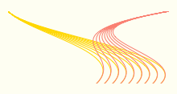

% Partial with Free Variables --- _[Smooth CoffeeScript](http://autotelicum.github.com/Smooth-CoffeeScript/)_
% 
% ☕

> This literate program is _interactive_ in its HTML form. Edit a CoffeeScript segment to try it. You can see the generated JavaScript as you modify a CoffeeScript function by typing 'show name' after its definition.

##Partial function application with free variables

Partial function application is presented in [Smooth CoffeeScript partial application](http://autotelicum.github.com/Smooth-CoffeeScript/SmoothCoffeeScript.html#entry-partial-application-0). It is a way to create a function from another function where the first arguments are filled in. With the new function we can then ignore those arguments so subsequent calls become easier to read and write.

It is not always the case that arguments are so nicely ordered that it is the first ones that need to be held constant. To handle the general case with arbitrary arguments, a special symbol[^1] can designate free variables i.e. those arguments that are not fixed.

[^1]: In the examples underscore `_` is used. You may want to choose another symbol to avoid clashes with commonly used libraries such as [Underscore](http://documentcloud.github.com/underscore/).

In the code below[^2] the  `movement` function is inspired by the canvas function `bezierCurveTo`. It takes nine arguments, clearly outdoing `bezierCurveTo`'s measly six arguments. When calling such a function from many places, several of the arguments may well be the same.

[^2]: To run this example standalone you can prepend this [CoffeeKup](http://coffeekup.org/) CoffeeScript:

        show = if exports? then console.log else alert
        (require 'fs').writeFileSync "./bezier.html",
          webpage = (require 'coffeekup').render -> 
            doctype 5
            html -> meta charset: 'utf-8',
              head -> title 'Bezier path'
              body -> 
                canvas id: 'drawCanvas', width: 300, height: 200
                coffeescript ->
                  window.onload = ->
                    canvas = document.getElementById 'drawCanvas'
                    ctx = canvas.getContext '2d'
                    alert 'No canvas in this browser.' unless ctx?
                    draw ctx if draw?

~~~~ {.coffeescript}
draw = (ctx) -> # Try changing colors below
  ctx.beginPath(); ctx.strokeStyle = 'gold'
  drawMove ctx, (ix for ix in [0...90] by 10)
  ctx.beginPath(); ctx.strokeStyle = 'salmon'
  drawPath ctx, (ix for ix in [0...90] by 10)

movement = (ctx, ax, ay, cp1x, cp1y, cp2x, cp2y, x, y) ->
  ctx.moveTo ax, ay
  ctx.bezierCurveTo cp1x, cp1y, cp2x, cp2y, x, y

drawMove = (ctx, args) ->
  args.forEach (ix) -> movement ctx,
    0, 0, 30, 30, 150+ix, 50, 110+ix, 90
  ctx.stroke()
~~~~

\ 

A wrapper function `swirl` that takes only those arguments that might change can cut down on the repetition. The `partialFree` function returns a new function when given a function, its fixed arguments and the placeholder symbol for the variable arguments.

~~~~ {.coffeescript}

_ = undefined
partialFree = (func, a...) -> (b...) ->
  func (for arg in a then arg ?= b.shift())...

swirl = partialFree movement, _, _, 0, 30, 30, _, 50, _, 90

drawPath = (ctx, args) ->
  args.forEach (ix) -> swirl ctx, 200, 150+ix, 110+ix
  ctx.stroke()
~~~~

## Prior Art

Where did the definition of `partialFree` come from? It started with a [search](http://duckduckgo.com/?q=Partial%20function%20application) for existing implementations. The search eventually turned up this JavaScript version from [Angus Croll's blog](http://javascriptweblog.wordpress.com/2010/05/17/partial-currys-flashy-cousin/).

~~~~ {.javascript}
window.___ = {}; //argument placeholder

Function.prototype.partial = function() {
    if (arguments.length<1) {
        //nothing to pre-assign - return the function as is
        return this;
    }
    var __method = this;
    var args = arguments;
    return function() {
        //build up new arg list, for placeholders use current arg,
        //otherwise copy original args
        var argIndex = 0, myArgs = [];
        for (var i = 0; i < args.length; i++) {
            myArgs[i] = window.___==args[i] ?
                arguments[argIndex++] : args[i];
        }
        return __method.apply(this, myArgs);
    }
}
~~~~

And this CoffeeScript version from [Mirotin](http://blog.mirotin.net/8/15-lines-long-partial-function-application-with-coffeescript-js).

~~~~ {.coffeescript}
_ = {}
partial15lines = () ->
  [func, args...] = arguments
  wrapper = () ->
    i = 0
    j = 0
    res_args = []
    while i < args.length
      if args[i] == _
        res_args.push arguments[j]
        j++
      else
        res_args.push args[i]
      i++
    return func.apply null, res_args
~~~~

## Stepwise CoffeeScript Improvements

Those implementations are fine and usable as they are. But here comes one of the most fun activities in CoffeeScript: _code reduction_. It is also useful because less code makes maintenance easier --- up to a point --- too clever tricks and the code can become harder to understand. In the following line of code reductions, which one would you choose as the best balance between brevity and readability?

In `partial15lines` there are some redundant words that can be removed. The use of [arguments](http://autotelicum.github.com/Smooth-CoffeeScript/SmoothCoffeeScript.html#entry-arguments-0) can also be replaced with a splat `...`

~~~~ {.coffeescript}
_ = {}
partial12lines = (func, args...) ->
  (moreargs...) ->
    i = j = 0
    res_args = []
    while i < args.length
      if args[i] == _
        res_args.push moreargs[j++]
      else
        res_args.push args[i]
      i++
    func.apply null, res_args
~~~~

In CoffeeScript `while` is an expression that returns the value of its inner block, so there is no need for pushing values to a results array.

~~~~ {.coffeescript}
_ = {}
partial10lines = (func, args...) ->
  (moreargs...) ->
    i = j = 0
    func.apply null,
      while i++ < args.length
        if args[i-1] == _
          moreargs[j++]
        else
          args[i-1]
~~~~

A `for` loop instead of the `while` gets rid of the `length` check. A splat can also be used in a call which eliminates the `apply`. The old school `==` can be replaced with `is`.

~~~~ {.coffeescript}
_ = {}
partial8lines = (func, a...) -> (b...) ->
  i = 0
  func (for arg in a
    if arg is _
      b[i++]
    else
      arg)...
~~~~

The low level counter `i` is only used to get the next argument from `b`. The same effect can be achieved by treating `b` as a LIFO (Last In First Out) buffer. To do that `b` has to be reversed.

~~~~ {.coffeescript}
_ = {}
partial5lines = (func, a...) -> (b...) ->
  b.reverse()
  func (for arg in a
    if arg is _ then b.pop() else arg)...
~~~~

Instead of using an empty object as the placeholder, using `undefined` allows the `if` test to be replaced with an [existential assignment](http://autotelicum.github.com/Smooth-CoffeeScript/SmoothCoffeeScript.html#entry-existential-operator-0) `?=`.

~~~~ {.coffeescript}
_ = undefined
partial4lines = (func, a...) -> (b...) ->
  b.reverse()
  func (for arg in a then arg ?= b.pop())...
~~~~

Reversing the `b...` arguments are only required because `pop` returns the last element. Noé Rubinstein joined the  _code reduction_ fun by noticing that the `Array::shift` function removes and returns the first argument.

~~~~ {.coffeescript}
_ = undefined
partial3lines = (func, a...) -> (b...) ->
  func (for arg in a then arg ?= b.shift())...
~~~~

## Test

A couple of test cases and an example of `partial`. In the interactive HTML you can try substituting the number in `partial3lines` to test the other versions.

~~~~ {.coffeescript}
test = ->
  f = (x, y, z) -> x + 2*y + 5*z
  g = partialFree f, _, 1, _
  show "g 3, 5 => #{g 3, 5} Expected: 30"

  # Modified from an alexkg example
  fold = (f, z, xs) ->
    z = f(z, x) for x in xs
    z
  max = partialFree fold, Math.max, -Infinity, _
  show "max [-10..10] => #{max [-10..10]} Expected: 10"

  # Without free vars
  partial = (f, a...) -> (b...) -> f a..., b...
  min = partial fold, Math.min, Infinity
  show "min [-10..10] => #{min [-10..10]} Expected: -10"
partialFree = partial3lines
test()
~~~~

-----------------------------------------------------------------------------

\subsection{Output}
\VerbatimInput[baselinestretch=1,fontsize=\footnotesize,numbers=left]{partial.output}

\subsection{JavaScript}
\VerbatimInput[baselinestretch=1,fontsize=\footnotesize,numbers=left]{partial.js}

\rule[0.5ex]{1\columnwidth}{1pt}

Formats [CoffeeScript](http://autotelicum.github.com/Smooth-CoffeeScript/literate/partial.coffee)	[Markdown](http://autotelicum.github.com/Smooth-CoffeeScript/literate/partial.md) [PDF](http://autotelicum.github.com/Smooth-CoffeeScript/literate/partial.pdf) [HTML](http://autotelicum.github.com/Smooth-CoffeeScript/literate/partial.html)

License [Creative Commons Attribution Share Alike](http://creativecommons.org/licenses/by-sa/3.0/)
by autotelicum © 2554/2011

<!--
Commands used to extract code, execute it, and to format this document:

Edit ,x/^~~+[   ]*{\.[cC]offee[sS]cript.*}$/+,/^~~+$/-p
Edit ,>ssam -n 'x/^~~+[   ]*{\.[cC]offee[sS]cript.*}$/+,/^~~+$/-' |cat embed-standalone.coffee - |tee partial.coffee | coffee -cs >partial.js; coffee partial.coffee >partial.output; plumb partial.output
Edit ,>pandoc -f markdown -t html -S -5 --mathml --css pandoc-template.css --template pandoc-template.html -B embed-readability.html -B embed-literate.html | ssam 's/(<code class="sourceCode coffeescript")/\1 contenteditable=\"true\" spellcheck=\"false\"/g' | ssam 's/(<pre class="sourceCode")><(code class="sourceCode CoffeeScript")/\1 onclick=\"reveal(this)\" ><b><u>Solution<\/u><\/b><br\/><\2 contenteditable=\"true\" spellcheck=\"false\" style=\"display:none\" \"/g' | ssam 's//<canvas id=\"drawCanvas\" width=\"200\" height=\"100\"><\/canvas>/' >partial.html; open partial.html; plumb partial.html
Edit ,>markdown2pdf --listings --xetex '--template=pandoc-template.tex' -o partial.pdf; open partial.pdf

To execute these commands; middle-button select them in the acme environment.
acme and ssam are part of the plan9 OS and can run on *nix variants via plan9port.
The formatting is done with pandoc, a universal markup converter, and TeX.
-->
